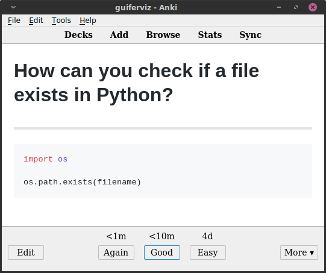

Generate Anki cards from text files (TSV and Markdown).

Text files are easily maintainable, `apkg` files are not.
You can easily store text files in a version control system like *git*, so you
can easily keep track of changes and collaborate with others.

Mnemocards can generate Anki cards from TSV

TODO: add pictures of text and generated cards.

Here you have the Python scripts I use for generating my Anki cards.
With this scripts you can easily generate cards from TSV and Markdown files.

# Requirements

* Python 3 and all the libraries listed in `requirements.txt`.
Install them with `pip install -r requirements.txt`.
* If you want to generate cards from your gists you should have Git installed.
Install it with in Ubuntu-like systems with `apt-get install git`.
Also, in order to use the GitHub API you should have a file with and API key
with Gists/repository permissions.

