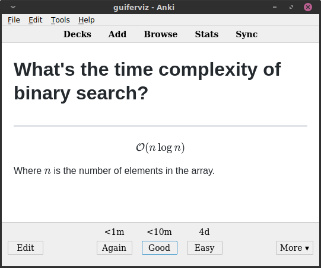

<a href="https://mnemocards.readthedocs.io/en/latest/">
    
</a>

Generate Anki cards from text files (TSV and Markdown).

Text files are easily maintainable, `apkg` files are not.
You can easily store text files in a version control system like *git*, so you
can easily keep track of changes and collaborate with others.

You can generate different kind of cards:

<center>


</center>
<center>



</center>

 * **Language cards** (first row):
 Specially designed to learn a language.
 There are two types of language cards:
   * **Vocabulary cards** (left):
   Cards displayed in 2 languages, your native language and the language you
   are learning.
   * **Expression cards** (right):
   When you already know a language and want to master it, sometimes it is no
   longer enough to translate into your language, but you want to write
   sentences in the language you are learning with their respective explanation
   also in the language you are learning.
 * **Markdown cards** (second row):
 Cards generated from `*.cards` files.
 This file format has been created in a specific for the creation of cards.
 Apart from a pair of start and end of card markers, the syntax of these files
 is Markdown.
 You can use images, Latex and math in the content of this cards.


# Requirements

 * Python 3 and all the libraries listed in `requirements.txt`.
 All these requirements are automatically installed when you install the
 package with `python setup.py install`.
 If you want to install the requirements manually just use:
 `pip install -r requirements.txt`.
 * If you want to import automatically the generated packages, you should have
 Anki installed.
 * If you want to generate cards from your repositories or gists you should
 have Git installed.
 Install it (in Ubuntu-like systems) with `apt-get install git`.
 Also, in order to use the GitHub API you should have a file with and API key
 with gists/repository permissions.
 The repository permission is only needed for private repositories.


# Install

Clone this repository, move to the root of the project and run:
```bash
python setup.py install
```


# Generate cards

The process of generating Anki's `*.apkg` files is based on the use of
configuration files.


# *Git* utilities

In order to keep my cards safe and centralize my knowledge database, I added a
few utilities to `mnemocards` to clone and push many *GitHub* repositories at
the same time.

```
mnemocards github
```

```
mnemocards pull
```

```
mnemocards push
```


# Docker

A *Docker* image is available so that you can generate your packages without
having to install the package in your environment.
At the moment you need to have *Anki* installed locally.

The name of the image is `guiferviz/mnemocards`.
Find more information about it in:
https://hub.docker.com/repository/docker/guiferviz/mnemocards.


# VIM syntax file for `*.cards`

I'm a die-hard VIM user, for that reason I've created a `cards.vim` syntax
file.
It's not too fancy (I would like to add syntax color to the header of the
cards in the future) but it looks better than using the Markdown syntax.


I also use the plugin [Markdown Preview][1] so I can see how my cards look like
without generating the package.
It's not perfect for the `*.cards` format, but it's better than nothing :)


[1]: https://github.com/iamcco/markdown-preview.nvim

