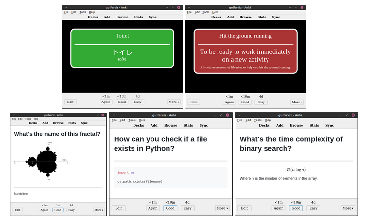
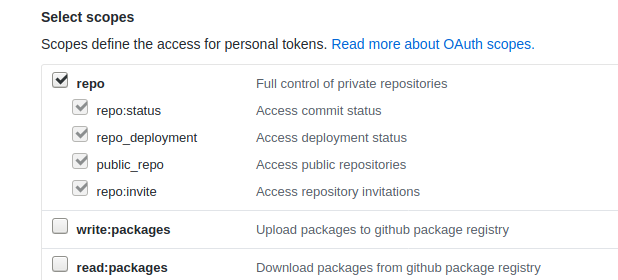

<a href="https://mnemocards.readthedocs.io/en/latest/">
    
</a>

Generate Anki cards from text files (TSV and Markdown).

<center>

</center>

Text files are easily maintainable, `apkg` files are not.
You can easily store text files in a version control system like *git*, so you
can easily keep track of changes and collaborate with others.

Mnemocards comes with some pre-design formats:

 * **Language cards** (first row of the last picture):
 Specially designed for learning a language.
 There are two types of language cards:
   * **Vocabulary cards** (right):
   Cards displayed in 2 languages, your native language and the language you
   are learning.
   This type of card gives you the possibility to auto-generate pronunciation
   audios directly from Google Translator.
   Also, if you are learning Japanese you can use ふりがな (furigana, the
   small hiragana characters on top of the Kanji)!
   * **Expression cards** (left):
   When you already know a language and want to master it, sometimes it is no
   longer enough to translate into your language, but you want to write
   sentences in the language you are learning with their respective explanation
   also in the language you are learning.
 * **Markdown cards** (second row):
 Cards generated from `*.cards` files.
 This file format has been created specifically for the creation of cards with
 Mnemocards.
 Apart from a pair of start and end of card markers, the syntax of these files
 is pure Markdown.
 You can use images, Latex and math in this kind of cards.


# Requirements

 * PyAudio, one of the Python dependencies requires the installation of
 **PortAudio-dev**.
 Install the package in Ubuntu-like systems with
 `apt install portaudio19-dev=19.6.0-1`.
 Maybe any other version of the package is working but that one is the one
 I'm using without problems.
 * **Python 3** and all the libraries listed in `requirements.txt`.
 All these requirements are automatically installed when you install the
 package with `python setup.py install`.
 If you want to install the requirements manually just use:
 `pip install -r requirements.txt`.
 * If you want to **import automatically the generated packages**, you should
 have **Anki** installed.
 * If you want to **generate cards from your repositories or gists** you should
 have **Git** installed.
 Install it (in Ubuntu-like systems) with `apt-get install git`.
 Also, in order to use the GitHub API you should have a file with and API key
 with gists/repository permissions.
 The repository permission is only needed for private repositories.


# Installation

Using `pip`:
```bash
pip install mnemocards
```

Installing from source code.
Clone this repository, move to the root of the project and run:
```bash
python setup.py install
```

Consider the option of using Docker if you do not want to install
the package and to set up all the needed environment.
Read the [Docker section](#docker) of this README to learn more about it.


# Generate cards

Move into the `examples/` directory and execute the next line to generate
all the `*.apkg` files in this directory and all the subdirectories.
```
$ mnemocards generate -r .
Building ./computer_science/cards_config.json
Building ./japanese/cards_config.json
Creating audio file ./japanese/media/hiragana/10091493812914340822.mp3
Creating audio file ./japanese/media/hiragana/7304217433350980427.mp3
Creating audio file ./japanese/media/hiragana/3595385396154511079.mp3
Creating audio file ./japanese/media/hiragana/5000408949304965326.mp3
Creating audio file ./japanese/media/hiragana/2088116759824648408.mp3
Creating audio file ./japanese/media/katakana/13050069045466478331.mp3
Creating audio file ./japanese/media/katakana/4834734646036555229.mp3
Creating audio file ./japanese/media/katakana/4275246117432970461.mp3
Creating audio file ./japanese/media/katakana/8563378359496393897.mp3
Creating audio file ./japanese/media/katakana/10683512746176998599.mp3
Building ./english/cards_config.json
Writing packages to a file...
$ ls
computer_science  cs.apkg  english  english.apkg  japanese  japanese.apkg
```

Now you have 3 `*.apkg` files in this directory that you can import to Anki
manually or using Mnemocards (see the [import section](#import-cards-to-anki)).
During the generation process 10 audio files has been created for the Japanese
decks.
These audio files come from Google Translator.
If you repeat the command again, no audio is downloaded again, so the process
of adding new words to a vocabulary is going to be faster.

Mnemocards commands come with documentation that you can read adding `--help`
to any command.
For example, if you want to see all the options you can use with the `generate`
command just execute:
```
$ mnemocards generate --help
usage: mnemocards generate [-h] [--config-file CONFIG_FILE] [--recursive]
                           [--output-dir OUTPUT_DIR]
                           DATA_DIR

positional arguments:
  DATA_DIR              Directory with the configuration and text data to use
                        for generating the Anki cards.

optional arguments:
  -h, --help            show this help message and exit
  --config-file CONFIG_FILE, -f CONFIG_FILE
                        Configuration file to search in the DATA_DIR.
  --recursive, -r       Search recursively for configuration files in the
                        given DATA_DIR.
  --output-dir OUTPUT_DIR, -o OUTPUT_DIR
                        Output directory where the packages are going to be
                        saved. Current directory by default.
```

The process of generating Anki `*.apkg` files is based on the use of
configuration files.
By default, the configuration file is called `cards_config.json`.
There are three different `cards_config.json` in the examples, one in each
directory (`computer_science/cards_config.json`, `english/cards_config.json`
and `japanese/cards_config.json`)

The `-r` option used in the `generate` command indicates Mnemocards to search
for those configuration files recursively.
If you want to generate only the `japanese.apkg` use
`mnemocards generage japanese` or move into `examples/japanese` and execute
there `mnemocards generate .`.


## Configuration files `cards_config.json`

Configuration files contain how many packages to build, the number of decks,
deck configurations and the input source of the data (TSV files and Markdown
files).

The most basic configuration file is:
```json
{
    "packages": [
        {
            "name": "APKG_filename",
            "decks": [
                {
                    "id": "ad054cdc-160b-4b77-a8a5-4da79fe5d8a5",
                    "name": "Deck name",
                    "src": [
                        {
                            "type": "markdown",
                            "file": "my_file.cards",
                        }
                    ]
                }
            ]
        }
    ]
}
```

Each configuration file can generate one or more `*.apkg` packages.
Each package can contain one or more decks.
Each deck can consist of one or more source text files.

It is recommended to specify a deck ID, otherwise a hash of the deck name will
be used, which implies that if the name is changed the deck will be considered
as a new deck by Anki, loosing any learning progress.

Apart from the deck ID, name and source files, you can specify a deck config.
Look to this example:
```
{
    "id": "e9a0b7ba-641a-4af6-8631-be9854a4e9d8",
    "name", "My deck name",
    "config": {
        "id": "65bcc65b-b4de-4ce4-b5c1-a73a2f64b82d",
        "name": "My deck name (Configuration)",
        "timer": 1,  # Active timer
        "maxTaken": 30,  # Max seconds taken by the timer
        "new": {
            "bury": true,
            "initialFactor": 1500,
            "perDay": 5,  # Number of new cards per day
            "delays": [1, 10, 1440, 4320, 10080],
            "ints": [7, 14]
        },
        "lapse": {
            "leechAction": 1  # Mark leech cards. Set to 0 to suspend.
        }
    },
```

Note that the comments added to the right of some properties are not a valid
JSON syntax, they are added here only for this tutorial.
You can read about [all the deck config options][ankidroidDeckConfig] you can
use in the Ankidroid documentation.

The `src` property should have at least one file in order to generate
some cards for that deck.
`type` and `file` are the two required properties.
Depend on the type you can add more properties.


### `markdown` type

```json
{
    "type": "markdown",
    "file": "math.cards",
    "card_properties": {
        "tags": ["math"]
    }
}
```

Apart from `type` and `file` you can add:
* `card_properties`.
Properties that are applied to all the cards in this file.
For exampe: using this property you avoid setting tags in all the cards inside
of that file.
    * `tags`. The tag property is the only one available at the moment.
    It is an array of tags.
    Even if you only what to specify one tag you should use an array with one
    element.


### `vocabulary` type

```json
{
    "type": "vocabulary",
    "file": "hiragana.tsv",
    "header": true,
    "pronunciation_in_reverse": false,
    "card_color": "#33AA33",
    "furigana": false,
    "audio": {
        "lang": "ja",
        "media_dir": "media/hiragana"
    },
    "card_properties": {
        "tags": ["japanese", "hiragana"]
    }
},
```

* `header`. The first line of the TSV file is a header line, so it will be
skipped.
* `pronunciation_in_reverse`.
By default, when the vocabulary card is shown in reverse the pronunciation
is not showed.
Set this option to true if you want want the pronunciation.
It will be shown once you press the *Show answer* button.
* `card_color`.
Card background color in hexadecimal.
* `furigana`.
If you are learning Japanese, maybe you want to use furigana (small hiragana
characters over Kanji) in your cards.
Set this flag to true if you want to use them, by default false.
In your TSV files your furigana must be written between brackets and with a
space before the Kanji.
For example, `日[に] 本[ほん] 語[ご]`.
* `audio`. If you want to generate and audio file of the language you are
learning, you should specify here the language.
    * `lang`. The language used to generate those file using ISO 639-2.
    You can find a [table with the ISO 639-2][wikipediaIso2] for all the
    languages in Wikipedia.
    If the pronunciation is not available in Google Translator this is not
    going to work.
    * `media_dir`. Directory where the audio files are stored.
    After generating the package for the first time, this folder will be
    created and filled with all the audio files.
    If you don't delete this folder, the next time Mnemocards will be much
    faster because it already has all the audio files generated.
* `card_properties` has the same meaning as in Markdown cards.


### `expression` type

```json
{
    "type": "expression",
    "file": "expressions.tsv",
    "header": true,
    "card_color": "#AA3333",
    "card_properties": {
        "tags": ["english", "expressions"]
    }
}
```

`header`, `card_color` and `card_properties` have the same meaning as in
vocabulary cards.


## `*.cards` file format

A card has the following syntax:
```card
<<<
header
===
title
---
body
>>>
```

The header section contains some metadata about the card (ID and tags), the
title is the front part of the card and the body in the hidden part that is
shown when you press the *Show Answer* button on Anki.

The header section has a *YAML* syntax and the title and body section use
Markdown syntax.
Notice than the separators `===` and `---` are legal Markdown syntax for
generating headers, so it's recommended to use `#` and `##` instead in your
title and body.

The header and the body are not required, so the next example is also a card:
```card
<<<
title
>>>
```

However, it's highly recommended to give an ID to your cards.
If no ID is used, a hash of the title is going to be used as ID.
That means that the card ID will change if the title is changed (titles are
prone to change because of typos or future improvements you want to make to
your cards).
Cards with different IDs are considered as different cards by Anki, so you
will have duplicates and the new card will loose any progress.
Use IDs please.
The ID is given in the header and it's recommended to use a GUID:
```card
<<<
id: 07924f36-ccfa-4b72-ac21-11f8b151d42f
===
# Title
---
Body
>>>
```

Another legal property that you can define in the header are tags.
Use a comma separated list with the names of all the tags you want to assign
to that card:
```card
<<<
id: 07924f36-ccfa-4b72-ac21-11f8b151d42f
tags: tag1,tag2,tag3
===
# Title
>>>
```

Use inline math formulas using a dollar (ex: `$x^2$`) and a multi-line formula
using two dollars (ex: `$$\sum_i x_i$$`) in any part of the title or body.

You can also add images to the cards using an `` tag.
At the moment the Markdown syntax for images `` is not supported.
Notice that the image names should be unique over all the images in your Anki
decks, so avoid names like `1.png` or `example.png`.


## TSV Vocabulary files

TSV vocabulary files should contain the next columns.
At the moment, the columns **should be in the given order**.

* `ID`.
Characters that uniquely identify a note.
This number must be unique not only in the file but in the whole collection,
that is why we recommend using a UUID (a sequence of alphanumeric characters
such as: 64012c71-9aea-4622-aac7-2595d6798737).
Having a UUID is necessary to be able to update the cards (make spelling
corrections or improve them with extra information) and not lose the progress.
* `YourLanguageWord`.
The word you want to learn but in your mother tongue or in a known language.
* `YourLanguageExplanation`.
Any extra detail to help you get the word you're looking for.
A clear example of use is when you have to explain a word that does not have a
direct translation in your language or when the translation in your language
is a word that has more than one meaning.
For example: in Japanese flat and thin objects use different numbers, so the
translation of 一枚 is obviously "one" but to make the reverse translation we
need a clarification like "one, when counting flat and thin objects".
* `LanguageYouLearnWord`.
The word written in the language you are trying to learn.
* `LanguageYouLearnPronunciation`.
Write here how you can pronounce the word of the language you are learning.
If you choose to generate an audio with the pronunciation, the audio is going
to be placed here.
* `LanguageYouLearnExplanation`.
This explanation will always accompany the word in the language you want to
learn.
It explains in what alternative forms the word can appear as synonyms or
variations in writing.
Do not give any extra information that reveals the meaning of the word, as it
will appear on the front of some cards where your goal will be to make the
translation into your language.
For example: English "hit, to punch someone" to Spanish "pegar, you can also
use 'golpear'".
* `Tags`.
The tags you write here are added to the tags specified in the
`cards_config.json`.


This is how the fields are shown in the cards.
Front card format:

    YourLanguageWord
    YourLanguageExplanation
    ---                            # After showing answer
    LanguageYouLearnWord           # After showing answer
    LanguageYouLearnPronunciation  # After showing answer
    LanguageYouLearnExplanation    # After showing answer

Reverse card format:

    LanguageYouLearnWord
    LanguageYouLearnPronunciation  # After showing answer
    LanguageYouLearnExplanation
    ---                            # After showing answer
    YourLanguageWord               # After showing answer
    YourLanguageExplanation        # After showing answer

For Japanese language there is an special flag in `cards_config.json` named
`furigana`.
If you mark this flag to true the Kanjis in the front side are going to be
shown alone and in the back side are going to be shown with furigana.
This makes the field `LanguageYouLearnPronunciation` not really required when
creating Japanese cards (you can always use romaji here, of course).


## Expressions TSV files

Similarly to vocabulary TSV files, the expression TSV files contain:
At the moment, the columns **should be in the given order**.

* `ID`
Characters that uniquely identify a note.
This number must be unique not only in the file but in the whole collection,
that is why we recommend using a UUID (a sequence of alphanumeric characters
such as: 64012c71-9aea-4622-aac7-2595d6798737).
Having a UUID is necessary to be able to update the cards (make spelling
corrections or improve them with extra information) and not lose the progress.
* `Expression`.
Expression that you want to learn.
* `Explanation`.
Extra explanation of the expression if needed.
* `Meaning`.
Meaning of the expression.
* `Example`.
Example sentence of use of the expression.
* `Tags`.
The tags you write here are added to the tags specified in the
`cards_config.json`.

This type of notes only have one front card.
Front card:

    Expression
    Explanation
    ---          # After showing answer
    Meaning      # After showing answer
    Example      # After showing answer

Of course, these types of cards are created for the purpose of learning a new
language, but they can be used for any other purpose as long as the fields
described here fit your purpose.


# Import cards to Anki

Use the command `mnemocards import --help` to get the instructions about
importing `*.apkg` files.

```
$ mnemocards import --help
usage: mnemocards import [-h] [--profile-name PROFILE_NAME]
                         [--collection-path COLLECTION_PATH]
                         apkgs [apkgs ...]

positional arguments:
  apkgs                 List of packages to import.

optional arguments:
  -h, --help            show this help message and exit
  --profile-name PROFILE_NAME, -p PROFILE_NAME
                        If your collection is in the default location
                        (`~/.local/share/Anki2/`) you can specify only the
                        profile name. You cannot use this option as the same
                        time as `-c`.
  --collection-path COLLECTION_PATH, -c COLLECTION_PATH
                        Specify the full path of the collection file. If you
                        use this option with `-p` (profile name), the profile
                        name has preference over the full collection path.
```

To import an `*.apkg` file you need to close Anki, otherwise the collection
file cannot be written.
Remember that you need to open Anki and synchronize the collection with
Web Anki to see the updated collection in all your devices.


# *Git* utilities

In order to keep my cards safe and centralize my knowledge database, I added a
few utilities to `mnemocards` to clone and push many *Git* repositories at
the same time.

The first step is to know which repositories you want to clone.
I like to create a new private repository for every subject I'm learning.
For example:

 * Japanese: under my profile I have a repository called `learning_japanese`.
 * Programming: I have a repository called `learning_programming`.
 * And so on...

My aim is to clone all these repositories in an easy way and make them very
accessible so that any time I think of something I want to remember I don't
postpone it because of laziness.
As I'm always learning I have a lot of repositories.
To automate this task I've created the `mnemocards github` command.

The result of executing the next command is a `~/.mnemocards` file with a list
of all the repositories with Anki cards and the local path in my PC where I
want them to be cloned.
```
$ mnemocards github -i "guiferviz/learning_([^ _]*)" -d ~/learning
... some output ...
$ cat ~/.mnemocards
{
    "repos": [
        [
            "git@github.com:guiferviz/learning_japanese.git",
            "~/learning/japanese"
        ],
        [
            "git@github.com:guiferviz/learning_programming.git",
            "~/learning/programming"
        ]
    ]
}
```

To execute that command you need a file with your GitHub API key with enough
permissions to read your repositories.
Go to [GitHub Tokens][githubTokens] and generate a new one with permissions
for reading your repositories.
If you want to read private repositories select the next permissions:



If you want to use the `mnemocards github --gists` option, that is, cloning
gists instead of repositories, your GitHub API key should have different
permissions.
I do not use gists because they do not allow to commit directories and I want
to have my images good organized.


You can also create the `~/.mnemocards` file by hand taking the given example
and substituting the URLs and the local paths.

Once you have your file manually create or automatically created, you can
clone all your repos with the next command.
If your repo is already cloned, this command also pulls the last changes from
the server.
```
mnemocards pull
```

To commit and push all the changes in a repository use the next command.
Everything in your repositories is going to be added and committed, so if you
do not want to include all the files add exclude patters in your `.gitignore`
or push all your repositories manually.
Commits are made using a default commit message similar to
"Updating repository with mnemocards.".
```
mnemocards push
```


# Docker

A *Docker* image is available so that you can generate your packages without
having to install Mnemocards in your environment.
At the moment you need to have *Anki* installed locally.
The Docker image I've built for you is named `guiferviz/mnemocards` and it
is available in the [Mnemocards Docker Hub repository][dockerMnemocards].
Read the documentation under the `docker/` directory to learn how to execute
the image.

If you want to generate the Docker image by your own, you will also find all
the information in the `docker/` directory (`Dockerfile` and build commands).

As Docker images are auto-generated when a new version tag is pushed to the
GitHub repository, using Docker is a very convenient way to switch between
different versions of Mnemocards.


# VIM users

I'm a die-hard VIM user, for that reason I've created a `vim_syntax/cards.vim`
**syntax file**.
It's not too fancy but it looks better than using the Markdown syntax.

Using Markdown syntax:


Using my own Cards syntax:


Among my [UltiSnips][ultiSnips] **snippets** I have one that generates a new
card with an unique ID, a title and a body.
```snippet
snippet card "Create a new card" b
<<<
id: `!p if not snip.c: snip.rv = get_uuid()`
===
# ${1}
---
${2}
>>>
endsnippet
```
The `get_uuid` function is defined as:
```python
def get_uuid():
    """Get an UUID string. """

    import uuid
    return str(uuid.uuid4())
```

I also use the [Markdown Preview][markdownPreview] plugin so I can see **how my
cards look like without generating the package**.
It's not perfect for the `*.cards` format, but it's better than nothing :)


[markdownPreview]: https://github.com/iamcco/markdown-preview.nvim
[ultiSnips]: https://github.com/SirVer/ultisnips
[dockerMnemocards]: https://hub.docker.com/repository/docker/guiferviz/mnemocards 
[githubTokens]: https://github.com/settings/tokens/new
[ankidroidDeckConfig]: https://github.com/ankidroid/Anki-Android/wiki/Database-Structure#dconf-jsonobjects
[wikipediaIso2]: https://en.wikipedia.org/wiki/List_of_ISO_639-2_codes

