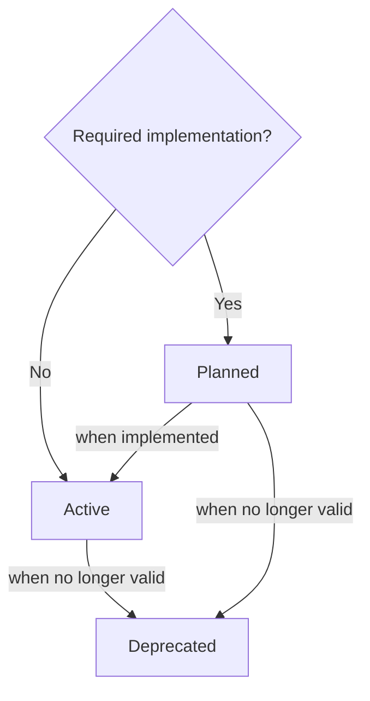

# MEP 0 - Mnemocards Enhancement Proposals


{{
    ep_header(
        authors=["guiferviz"],
        status="Active",
        created="2023-01-20",
        version="0.0.1",
    )
}}

This first MEP introduces MEPs. Here we define what MEPs are, what process
should be followed to propose one and what information they should contain.

## What is a MEP?

MEP stands for Enhancement Proposal. A MEP is a design document providing
information to the Mnemocards community, or describing a
new feature for Mnemocards or its processes or
environment. MEP is to Mnemocards what PEP is to Python. In
fact, the first two sentences of this paragraph are an adaptation of the first
lines of [PEP 1](https://peps.python.org/pep-0001/) :slightly_smiling_face:.

## Creation process

At the moment, the creation process is very simple:

1. Create a new file inside `docs/eps`. The number of the new MEP should be
chosen by adding 1 to the last existing MEP.
2. Copy the header macro of this MEP and update the different values. Learn how
to set the status in the following flow diagram.
3. Write the document. See more about this point in the following section.
4. Publish a PR to start the review/discussion.

Flow diagram that defines how to set an status:

## What a MEP should contain?

MEP files should be written in a friendly way, without assuming too much
knowledge on the part of the reader. It is a technical document, but technical
terms should not be abused.

A common structure is not required, just make sure it is comprehensible.
Include an abstract after the metadata table at the beginning and organise the
article into sections of your choice.
